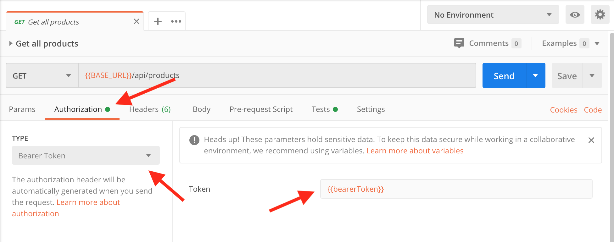

# WireMock Examples

## Mock Bearer Auth

The [post-auth-token](wiremock/mappings/post-auth-token.json) has a example of how to obtained the token.

To enable the request to start to check the token, use the code below:

```json
"request": {
  "headers": {
    "Authorization": {
      "matches": "^Bearer.[a-zA-Z0-9]{20}$"
    }
  }
}
```

In the [Postman file](postman/wiremock.postman_collection.json), enable the token with the config below:


